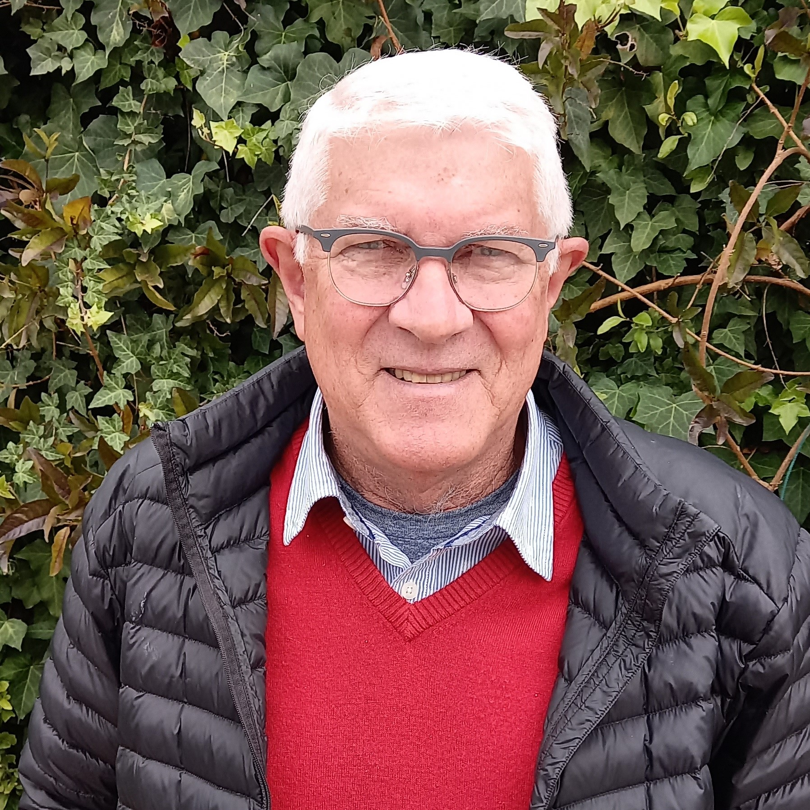
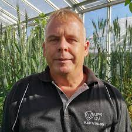
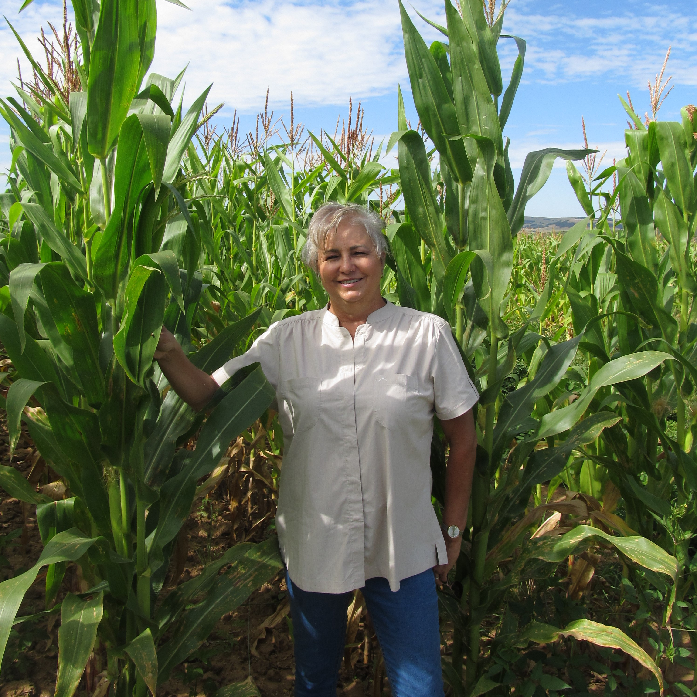

---

# Contributors

## Professor Zakkie Pretorius  
Retired plant pathologist and former head of the Department of Plant Sciences at UFS. Extensive experience of rust diseases of field crops, in particular the small grain cereals.

 

## Professor Willem Boshoff 
Associated Professor in plant pathology in the Department of Plant Sciences at the UFS. His main research focus is rust diseases of cereal crops which include pathogenic variation and control strategies. 

## Dr Cornel Bender 
insert short bio here

# Curators 

## Dr Lisa Rothmann
Lecturer and researcher in the plant pathology division, the Department of Plant Sciences, with a passion for sharing our wonderful science with all. 

 

# Acknowledgements
Contributions from the many funders, institutions, co-workers and students who contributed to rust research at UFS are greatly appreciated.

---