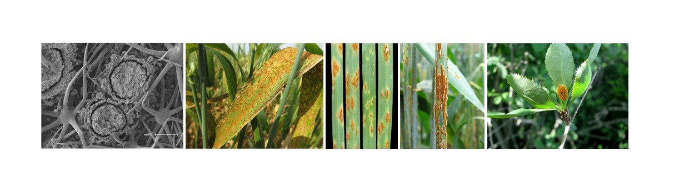

 

----

This repository is a selection of images of rust diseases assembled by plant pathologists from the University of the Free State, Bloemfontein, South Africa. It is not intended to be a complete checklist of rust fungi in South Africa, but rather pictures of signs and symptoms of rusts studied or collected over several years. For some diseases, images of their microscopic nature are included.  

~~~
 You can view all the images through the `explore the gallery` tab.
~~~

Although, should you prefer to download the original high quality images feel free to navigate to the Open Science Framework repository: [Repository of South African Plant Rust Images](https://osf.io/UGJ8Z/). 

Please cite images as follows: 

>Pretorius, Z.A. Bender, C.M., and Boshoff, W.H.P. 2023. The Repository of South African Plant Rust Images. Available at: DOI 10.17605/OSF.IO/UGJ8Z

This website includes the following content:  
- `WHAT ARE RUSTS`: A quick overview of what plant rusts are and the spore types associated with rusts.  
- `HOW TO USE`: A guide to the use of the images, how to cite them and a disclaimer.  
- `EXPLORE THE GALLERY`: The image viewing platform of 10 genera of rusts, a total of ~500 images, as well as some rusts which are still under investigation.  
- `RELATED PUBLICATIONS`: A list of the peer-reviewed publications associated with rust species.  
- `THE TEAM`: You can get to know the team who contributed there images and sequencing of these species, as well as the curator of the website.  

Plant pathologists are excellent photographers but opportunities to share their images are often limited to articles, conferences and more recently social media. In most cases a wealth of exceptional photographs of plant diseases, and the organisms that cause them, remain buried on computers. Here, we share some of our rust pictures and hope that this resource will add to disease records and descriptions, visual diagnostics, teaching aids, etc. We hope this website inspires you take good pictures and capture your passion for plant pathology.

----
